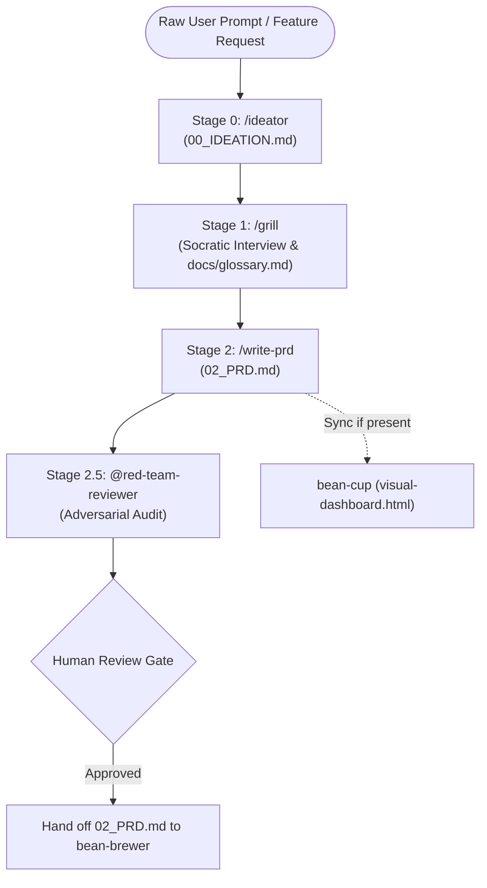

# 🔥 Bean-Roaster

> Product Discovery, Socratic Alignment, Domain Modeling, and PRD Synthesis Engine for Antigravity SDLC pipelines (Stages 0–2).

---

## ☕ Why "The Roaster"? (The Metaphor)

In coffee production, raw green coffee beans are dense, hard, and flavorless. You cannot grind or brew them in their raw state. They must first undergo controlled thermal profiling in the roaster—developing body, caramelizing sugars, and unlocking aromatic complexity.

In software engineering, raw feature requests and initial user prompts are the green beans: vague, full of hidden assumptions, and unready for implementation. 

**`bean-roaster`** is the roasting chamber of our swarm:
- It takes raw, ambiguous ideas and subjects them to rigorous Socratic grilling.
- It identifies user personas, core friction points, and domain boundaries.
- It bakes unassailable product requirements (`02_PRD.md`), establishes a ubiquitous domain language (`docs/glossary.md`), and subjects the design to adversarial red-team stress testing before a single line of application code is written.

---

## 🏛️ Origin & Architectural Rationale

### Spawned from `bean-to-cup`
**`bean-roaster`** was extracted from the monolithic [`bean-to-cup`](https://github.com/sapientcoffee/bean-to-cup) repository as part of a modular decomposition of the Antigravity barista swarm.

### Why Decompose?
1. **Dedicated Product Focus:** Product managers, solutions architects, and designers can use `bean-roaster` for rapid discovery and specification without pulling in bulky code generators, test runners, git worktree managers, or SRE tooling.
2. **Reduced Context Footprint:** Isolates requirements-gathering prompts, Socratic interview templates, and red-team auditing rules from unrelated implementation baggage.
3. **Strict Stage Boundary ("No Spec, No Code"):** Clear physical separation between the discovery phase (`bean-roaster`) and implementation phase (`bean-brewer`) reinforces architectural discipline: code is never written without an approved, hardened PRD.
4. **Markdown Contract Handoff:** Produces version-controlled, human-readable markdown artifacts (`00_IDEATION.md`, `docs/glossary.md`, `02_PRD.md`) that hand off seamlessly to `bean-brewer` and `bean-cup`.

---

## 🚀 Capabilities & Skills Reference

| Stage | Skill / Agent | Description |
| :---: | :--- | :--- |
| **0** | **`ideator` (`skills/ideator`)** | Explores problem friction, identifies user personas, maps Critical User Journeys (CUJs), and synthesizes initial data schemas into `00_IDEATION.md`. |
| **1** | **`grill` (`skills/grill`)** | Conducts a relentless Socratic interview to challenge architectural assumptions, clarify edge cases, and auto-generate `docs/glossary.md` and Architecture Decision Records (`docs/adr/`). |
| **1.5** | **`domain-modeling` (`skills/domain-modeling`)** | Defines ubiquitous terminology, entity boundaries, and bounded contexts to prevent domain leakage. |
| **2** | **`write-prd` (`skills/write-prd`)** | Synthesizes an executive-grade Product Requirements Document (`02_PRD.md`) with explicit Non-Goals, measurable KPIs, and acceptance criteria. |
| **2.5** | **`@red-team-reviewer` (`agents/red-team-reviewer.md`)** | Dispatches an adversarial subagent to audit the PRD for security flaws, race conditions, unhandled failure modes, and KPI ambiguities before human sign-off. |
| **—** | **`feature` (`skills/feature`)** | Orchestrator skill initializing versioned plan directories (`plans/<feature>/<timestamp>/`) and coordinating Stages 0 through 2. |

---

## 🔄 Discovery Workflow



---

## 🔌 Decoupled Telemetry

`bean-roaster` includes an opportunistic telemetry script (`scripts/sync_dashboard_if_available.py`):
- If `bean-cup` is installed in the workspace or plugin path, it automatically syncs updates to `visual-dashboard.html`.
- If `bean-cup` is absent, the script exits silently with code 0 without interrupting execution.

---

## 📦 Installation

```bash
# Install to local Antigravity plugin registry
./install.sh

# Or install via agy CLI
agy plugin install .
```

---

## 📜 License
Apache-2.0 - Copyright 2026 Google LLC.
